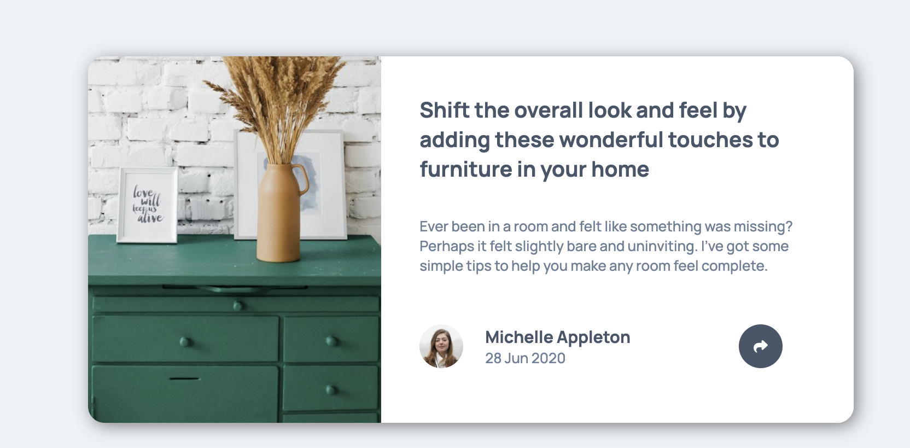

# Frontend Mentor - Article preview component solution

This is a solution to the [Article preview component challenge on Frontend Mentor](https://www.frontendmentor.io/challenges/article-preview-component-dYBN_pYFT). Frontend Mentor challenges help you improve your coding skills by building realistic projects. 

## Table of contents

- [Overview](#overview)
  - [The challenge](#the-challenge)
  - [Screenshot](#screenshot)
  - [Links](#links)
- [My process](#my-process)
  - [Built with](#built-with)
  - [What I learned](#what-i-learned)
- [Author](#author)

## Overview

### The challenge

Users should be able to:

- View the optimal layout for the component depending on their device's screen size
- See the social media share links when they click the share icon

### Screenshot

### Links

- Solution URL: [Add solution URL here](https://your-solution-url.com)
- Live Site URL: [Add live site URL here](https://your-live-site-url.com)

## My process

### Built with

- Semantic HTML5 markup
- CSS custom properties
- Flexbox
- JS

### What I learned

- How to responsively scale an element based on media size 
- Using JS file to add some element behvaior 
- Flexbox - how to align and strech element evenly accross the children within flex object

## Author

- Website - [Lucas Bui](https://www.lucasbui.com)
- Frontend Mentor - [@lucasbui88](https://www.frontendmentor.io/profile/lucasbui88)

